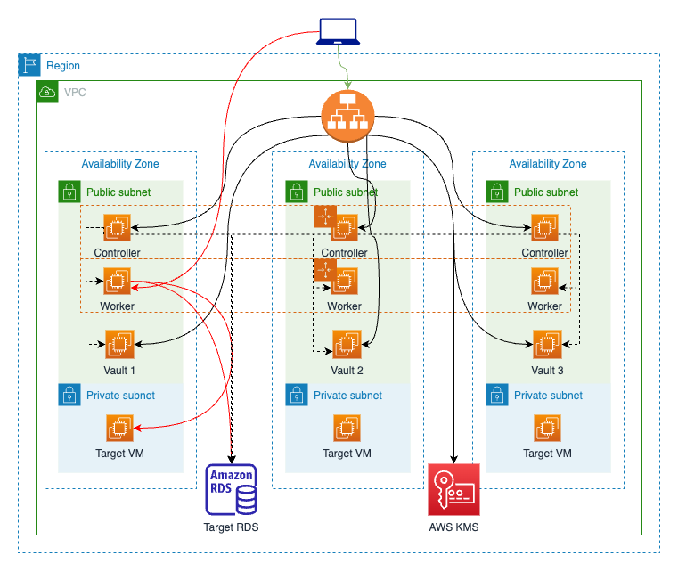

# Hashicorp Zero Trust Webinar
 
The `aws/` directory contains an example AWS architecture codified in Terraform and will deploy infrastructure consisting of 3 controllers, 3 worker, 1 PostgreSQL DB, a Vault Cluster and 2 vm target.

The `boundary/` directory contains an example Terraform configuration for setting up and configuring Boundary resources using the [Boundary Terraform Provider](https://github.com/hashicorp/terraform-provider-boundary).

The `vault/` directory contains an example Terraform configuration for setting up and configuring Vault resources using the [Vault Terraform Provider](https://github.com/hashicorp/terraform-provider-vault).

## Requirements
- Terraform ~> 1.0
- (Optional) Terraform Cloud Account https://app.terraform.io/app

## Setup
- Provide appropriate AWS credentials
- Edit backend.tf to your Terraform Cloud workspace or different backend
- terraform init

## Deploy

- terraform apply in aws
- If not using terraform cloud setup the required variables and run terraform apply in vault
- Repeat the same process for the boundary folder

## Reference

- https://github.com/hashicorp/boundary-reference-architecture
- https://github.com/tio-hashicorp/boundary-vault-demo
- https://learn.hashicorp.com/tutorials/boundary/aws-host-catalogs?in=boundary/configuration
- https://learn.hashicorp.com/tutorials/boundary/vault-cred-brokering-quickstart?in=boundary/configuration
- https://github.com/hashicorp/learn-boundary-vault-quickstart
- https://github.com/jasonwalsh/terraform-aws-boundary
- https://github.com/bitrockteam/caravan-infra-aws
- https://github.com/bitrockteam/caravan-vault
